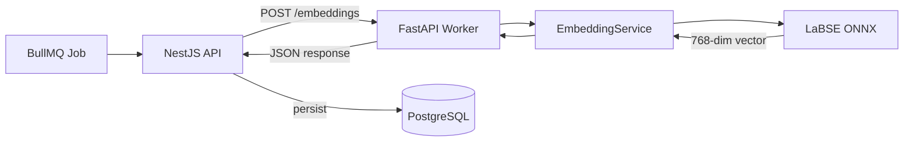

## Overview

The embedding worker is a stateful FastAPI service that loads a sentence-transformer model at startup and serves embedding requests over HTTP. It uses ONNX Runtime for CPU-optimized inference, eliminating the need for GPU hardware.



## File Structure

```
src/
├── config.py       # pydantic-settings configuration
├── models.py       # Pydantic request/response schemas
├── embedding.py    # EmbeddingService: model loading + inference
└── main.py         # FastAPI app, lifespan, routes
```

## Startup Lifecycle

The model is loaded during FastAPI's lifespan event, before any requests are accepted:

1. `Settings` loads configuration from environment / `.env`
2. FastAPI lifespan calls `EmbeddingService.load(model_name, backend)`
3. `sentence-transformers` downloads (or loads cached) model weights
4. ONNX Runtime session is initialized
5. `/health` starts returning `200 OK`

Until the model is loaded, `/health` returns `503` and the worker is not marked as ready.

## EmbeddingService

The core service is a thin wrapper around `sentence-transformers`:

- **`load(model_name, backend)`** — Loads the model with the specified backend (default: `onnx`). Extracts the short model name (e.g. `"LaBSE"` from `"sentence-transformers/LaBSE"`).
- **`encode(text)`** — Encodes a single text string into a 768-dim L2-normalized vector. Returns `list[float]`.
- **`is_ready`** — Property that returns `True` once the model is loaded.

Normalization is handled by `sentence-transformers` via `normalize_embeddings=True`, ensuring all vectors have unit length. This means cosine similarity can be computed as a simple dot product.

## Schema Design

Pydantic models use `camelCase` field aliases to match the Zod schemas in the NestJS API:

```python
job_id: str = Field(alias="jobId")        # accepts camelCase input
version: str                               # same in both cases
completed_at: str = Field(
    alias="completedAt",
    serialization_alias="completedAt"      # serializes as camelCase
)
```

The `ConfigDict(populate_by_name=True)` setting allows both snake_case and camelCase input. Serialization always uses camelCase aliases to match the API contract.

## Configuration

All settings are managed via `pydantic-settings` with environment variable overrides:

| Variable | Default | Description |
| --- | --- | --- |
| `HOST` | `0.0.0.0` | Server bind address |
| `PORT` | `5201` | Server port |
| `MODEL_NAME` | `sentence-transformers/LaBSE` | HuggingFace model identifier |
| `MODEL_BACKEND` | `onnx` | Inference backend (`onnx` or `torch`) |
| `LOG_LEVEL` | `INFO` | Python logging level |
| `OPENAPI_MODE` | `true` | Enable Swagger UI at `/docs` |

## Error Strategy

The worker follows the Faculytics convention of separating domain errors from infrastructure errors:

- **Domain errors** (bad input, model inference failure): Caught in the route handler, returned as HTTP 200 with `status: "failed"`. This prevents BullMQ from wasting retry budget on unrecoverable failures.
- **Infrastructure errors** (process crash, OOM): Bubble up as HTTP 5xx. BullMQ retries these according to its configured retry policy.

## Why LaBSE?

[LaBSE](https://arxiv.org/abs/2007.01852) (Language-agnostic BERT Sentence Embedding) was chosen because:

- Supports 109 languages including **Cebuano**, **Tagalog**, and **English** — the three languages present in student feedback
- Handles **code-switching** (mixing languages within a single sentence) naturally
- Produces embeddings in a shared multilingual vector space, so cross-language similarity works out of the box
- Available as an ONNX model for fast CPU inference
